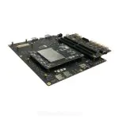

# Qualcomm® CM2290 Open Kits WIFI-MonoDepthEstimate-demo Developer documentation

## Introduce

Project in the cm2290 development kit system source code build and run on the CM2290 development board, make full use of the development kit diverse and powerful connection ability and computing ability. HostAPD and UDHCPD tools were used to enable AP WIFI, GStreamer, ZLMediaKit and FFMPEG were used to complete RTSP streaming media function, and TFLITE was used to complete reasoning operation of yolov5 traffic sign recognition model. 

CM2290 enable AP wifi and runs the binary executable file generated by compiling and constructing this project. The development board will continuously recognize the traffic signs in the images captured by the camera. After the mobile device is connected to WIFI, it can view the traffic signs on the mobile device in real time through rtsp.

CM2290 development board can be used for the development of dashcam.  Currently, the common dashcam only has the function of recording and saving video.  When playing back the recorded video, we expect to be able to jump directly to some traffic sign areas to quickly check whether we violate traffic rules.

Qualcomm® CM2290 SoC Open Kits



## Materials and Tools used for the project

1. Hardware materials

Except for the Open Kits,The following hardware materials are also needed:

* Type-C usb line

using the usb line to develop on Qualcomm® CM2290 SoC Open Kits.


* Charger

Direct power supply for Qualcomm® CM2290 SoC Open Kits.


* OVA3
Low power image sensor


## Environment configuration

This section mainly describes the source and configuration of some open source projects or third-party tools needed in the development process.

### Gstreamer
[Gstreamer](https://www.yoctoproject.org) <br>
GStreamer is a library for constructing graphs of media-handling components. The applications it supports range from simple Ogg/Vorbis playback, audio/video streaming to complex audio (mixing) and video (non-linear editing) processing.

### ZLMediaServer
ZLMediaServer is a high-performance operational level streaming media service framework based on C++11.

url: https://github.com/ZLMediaKit/ZLMediaKit

If you want to compile the project in source code, you can clone the entire project and modify zlmediakit_0.1.bb provided by the project to compile it using yocto.We also provide binary executables "MediaServer" generated by compilation in the bin directory.

### FFMPEG4
FFmpeg is a collection of libraries and tools to process multimedia content such as audio, video, subtitles and related metadata. url: https://www.ffmpeg.org/

In the same way, if you want to compile the project in source code, you can modify ffmpeg4_4.4.1.bb provided by the project to compile it using yocto.We also provide binary executables "ffmpeg4 & ffprobe4" generated by compilation in the bin directory.

### EasyPlayer APP
An free, elegant, simple, fast RTSP/RTMP/HLS/HTTP Player.EasyPlayer support RTSP(RTP over TCP/UDP)version& RTMP version & Pro version，cover all kinds of streaming media！

url: http://app.tsingsee.com/EasyRTSPlayer

### Opencv
OpenCV is a cross-platform computer vision and machine learning software library distributed under the Apache2.0 license (open source).
url: https://opencv.org/

### Tensorflow
TensorFlow is an end-to-end open source machine learning platform.
url: https://www.tensorflow.org/

## Compile

The compilation of the whole project is based on the yocto compilation tool, so you need to write some .bb and .conf files according to the specification. The trafficsign_0.1.bb file is provided in the project.

Please refer to [the official Manual of Yocto](https://www.yoctoproject.org) for how to add layers,write layer.conf. Then,excute the command as follows:

```
bitbake trafficsign
or
bitbake -b trafficsign_0.1.bb
```

You will get some executable bin file.Move to the bin folder of the project.

## Configure and Usage
Start the CM290 and connection CM290 to host by Type-c usb.
### 1. Configure
In the conf directory, a json configuration file is provided. This configuration file is relatively simple. It mainly configures the gstreamer camera pipeline, gstreamer udpsink push pipeline, and tflite yolov5 traffic sign recognition model are mainly configured.

### 2. Usage
The executable files in the bin directory do not require additional command line parameters. The parameters used by the program are configured by the json file, so you only need to put the configuration file in the same directory to execute the program.

```
adb push ./bin/trafficsign_test /data/yolov5
adb push ./models/traffic_sign_yolov5-fp16.tflite /data/yolov5
sh ap-wifi.sh
./trafficsign_test
```

**result show**</br>

